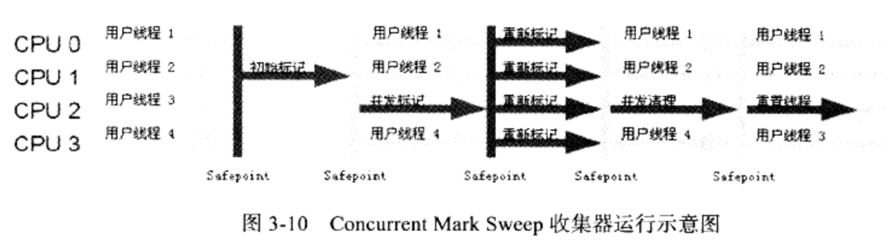

# 垃圾收集器

如果说**收集算法**是内存回收的**方法论**，那么**垃圾收集器**就是**内存回收**的具体实现。

## Serial收集器（新生代采用复制算法，老年代采用标记-整理算法）

serial收集器是最基本、发展历史最悠久的收集器，这个收集器是一个**单线程**收集器，他在垃圾收集时，必须暂停其他所有线程（**stop the world**）。

## ParNew收集器

**ParNew**收集器其实就是Serial收集器的**多线程版本**（除了serial收集器外，只有parnew收集器能用**cms收集器合作**）。ParNew收集器也是使用-XX:+UseConcMarkSweepGC选项后的默认新生代收集器，也可以使用-XX:UseParNewGC选项来强行制指定他，可以使用-XX:ParallelGCThreads参数来限制垃圾收集的线程数。

## Parallel Scavenge收集器（新生代采用复制算法，老年代采用标记-整理算法）

Parallel Scavenge收集器是一个新生代收集器，他也是使用**复制算法**的收集器，又是**并行**的**多线程**收集器。

**Parallel Scavenge收集器关注点是吞吐量（高效率的利用CPU）。CMS等垃圾收集器的关注点更多的是用户线程的停顿时间（提高用户体验）。所谓吞吐量就是CPU中用于运行用户代码的时间与CPU总消耗时间的比值。** Parallel Scavenge收集器提供了很多参数供用户找到最合适的停顿时间或最大吞吐量，如果对于收集器运作不太了解的话，手工优化存在的话可以选择把内存管理优化交给虚拟机去完成也是一个不错的选择。

**吞吐量 = 运行用户代码时间/（运行用户代码时间+垃圾收集时间）**

控制**最大**垃圾收集**停顿时间**：**-XX:MaxGCPauseMillis**

设置**吞吐量大小**：**-XX:GCTimeRatio**

开关参数，打开后不需要手工指定**新生代大小**（**-XX:Xmn**），eden区和**survivor**区的**比例**（**-XX:SurvivorRatio**）、晋升**老年代对象年龄**（**-XX:PretenureSizeThreshold**）等细节参数了，系统会动态调节这些参数，这种调节方式称为**GC自适应的调节策略**：-XX:UseAdaptiveSizePolicy

**GC停顿时间缩短**是以**牺牲吞吐量**和**新生代空间**来换取的，系统把新生代调小一些，这也直接导致**垃圾收集**发生的**更频繁**一些。

**自适应调节策略**也是**Parallel Scavenge收集器**和**ParNew收集器**的一个**重要区别**。

## Serial Old收集器（与Parallel Scavenge收集器搭配使用，CMS收集器的后备预案（发生concurrent mode failure））

**Serial Old**收集器是Serial收集器的**老年代版本**，他同样是一个**单线程收集器**，使用“**标记-整理**”算法。这个收集器的主要意义也是在于给Client模式下的虚拟机使用。

## Parallel Old收集器

Parallel Old是Parallel Scavenge收集器的老年代版本，使用多线程的“**标记-整理**”算法。

## CMS收集器

CMS（concurrent mark sweep）收集器是一种以**获取最短回收停顿时间**为目标的收集器。它的运作过程相比于前面几种垃圾收集器来说更加复杂一些。整个过程分为四个步骤：

- **初始标记：** 暂停所有的其他线程，并记录下直接与root相连的对象，速度很快 （stop the world）；
- **并发标记：** 同时开启GC和用户线程，用一个闭包结构去记录可达对象。但在这个阶段结束，这个闭包结构并不能保证包含当前所有的可达对象。因为用户线程可能会不断的更新引用域，所以GC线程无法保证可达性分析的实时性。所以这个算法里会跟踪记录这些发生引用更新的地方。
- **重新标记：** 重新标记阶段就是为了修正并发标记期间因为用户程序继续运行而导致标记产生变动的那一部分对象的标记记录，这个阶段的停顿时间一般会比初始标记阶段的时间稍长，远远比并发标记阶段时间短。（stop the world）
- **并发清除：** 开启用户线程，同时GC线程开始对为标记的区域做清扫。

## G1收集器